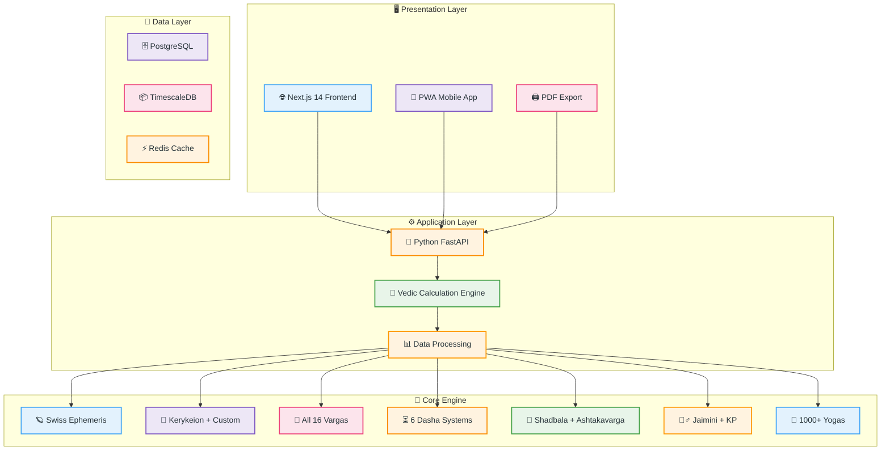

# 🪐 Jagannath Hora Web - Complete Free Vedic Astrology Platform

> 🌟 **100% Free, Web-Based, Open Source** - Replicating Jagannath Hora functionality for the modern web

---

## 🎯 Overview

**Jagannath Hora Web** is a comprehensive free online Vedic astrology platform that brings the complete power of Jagannath Hora desktop software to the web. Accessible anywhere in the world, like Drik Panchang, but with all advanced features of professional astrology software.

---

## 🏗️ Architecture



---

## 🌟 Features Comparison

| Feature | Jagannath Hora (Desktop) | Jagannath Hora Web |
|---------|--------------------------|-------------------|
| **Birth Chart (D1)** | ✅ | ✅ |
| **Navamsha (D9)** | ✅ | ✅ |
| **All 16 Vargas** | ✅ | ✅ |
| **Vimshottari Dasha** | ✅ | ✅ |
| **All Dasha Systems** | ✅ | ✅ |
| **Shadbala** | ✅ | ✅ |
| **Ashtakavarga** | ✅ | ✅ |
| **Jaimini Astrology** | ✅ | ✅ |
| **KP Astrology** | ✅ | ✅ |
| **Yogas Detection** | ✅ | ✅ |
| **Match Making** | ✅ | ✅ |
| **Panchang** | ✅ | ✅ |
| **Muhurta** | ✅ | ✅ |
| **Transit Analysis** | ✅ | ✅ |
| **Varshaphala** | ✅ | ✅ |
| **Web Based** | ❌ | ✅ |
| **Mobile Friendly** | ❌ | ✅ |
| **Offline PWA** | ❌ | ✅ |
| **Multi Language** | ❌ | ✅ |

---

## 🚀 Quick Start

The web app is **fully self-contained** — all Vedic calculations run in your browser using the high-precision `astronomy-engine` library, so **no backend is required** to use any feature.

```bash
# Clone the repository
git clone https://github.com/Margesh9999/jagannath-hora-web.git
cd jagannath-hora-web

# Install frontend dependencies
npm install

# Run the web app (http://localhost:3000)
npm run dev
```

### Optional: FastAPI backend (complementary REST API)

A Python FastAPI service mirrors the core calculations and exposes the REST endpoints
described in the architecture (`/api/v1/charts`, `/dashas`, `/panchang`, `/matching`).

```bash
pip install -r backend/python/requirements.txt
npm run dev:backend        # serves http://localhost:8000

# or run both together:
npm run dev:all
```

---

## 📱 Features

### 🪐 Chart Generation
- Birth Chart (Rashi / Lagna Chart)
- Navamsha (D9) and all 16 Varga Charts
- Transit Charts
- Varshaphala (Annual Chart)
- Horary (Prashna) Charts

### ⏳ Dasha Systems
- Vimshottari Dasha (120 years)
- Ashtottari Dasha (108 years)
- Yogini Dasha (36 years)
- Kalachakra Dasha
- Jaimini Chara Dasha

### 💪 Strength Analysis
- Shadbala (6-fold strength)
- Kaalbala (time-based)
- Ashtakavarga (8-fold points)
- Vimsopaka Bala (综合 strength)

### 🧘‍♂️ Advanced Systems
- Jaimini Astrology (Karakas, Aspects)
- KP Astrology (Sub-Lords, Ruling Planets)
- Nadi Astrology (Basic)

### 🧮 Yogas & Doshas
- 1000+ Yogas Detection
- Raj Yoga, Dhana Yoga, Gaja Kesari Yoga
- Mangal Dosha, Kaal Sarpa Yoga
- Pitra Dosha, Nadi Dosha

### 📅 Daily Tools
- Daily Panchang
- Festival Calendar
- Muhurta (Electional Astrology)
- Tithis, Nakshatras, Yogas, Karanas

### 💕 Match Making
- Ashta Koota (8-point matching)
- Mangal Dosha Compatibility
- Overall Compatibility Score

---

## 🛠️ Tech Stack

| Component | Technology |
|-----------|------------|
| Frontend | Next.js 14 + React + TypeScript |
| Styling | Tailwind CSS (Pastel Theme) |
| Backend | Python FastAPI |
| Ephemeris | Swiss Ephemeris |
| Vedic Library | Kerykeion + Custom |
| Database | PostgreSQL + TimescaleDB |
| Caching | Redis |
| Charts | D3.js + Custom SVG |

---

## 📄 Documentation

- [📖 Complete Documentation](docs/)
- [🔧 API Reference](docs/API.md)
- [🧮 Vedic Calculations](docs/VEDIC_CALCULATIONS.md)
- [🎨 Design System](docs/DESIGN.md)

---

## 🤝 Contributing

Open source project! Contributions welcome:

1. Fork the repo
2. Create feature branch
3. Make changes
4. Submit Pull Request

---

## 📜 License

**MIT License** - 100% Free, Forever

---

## 🙏 Acknowledgments

- Jagannath Hora (Original Desktop Software)
- Drik Panchang (Web Inspiration)
- Swiss Ephemeris (Astronomical Calculations)
- Kerykeion (Vedic Library)
- All contributors and community members

---

**Made with 🪐 and ❤️ for Vedic Astrology enthusiasts worldwide**

---

*🌟 "Making authentic Vedic astrology accessible to everyone, everywhere, for free."*