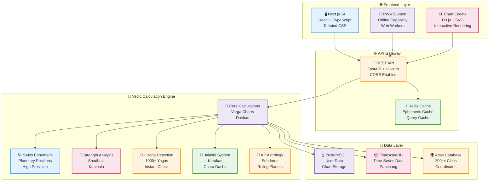
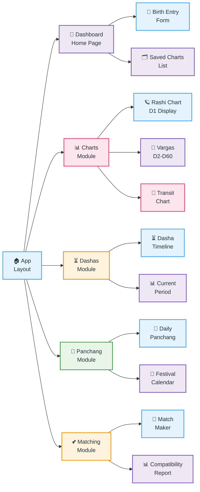
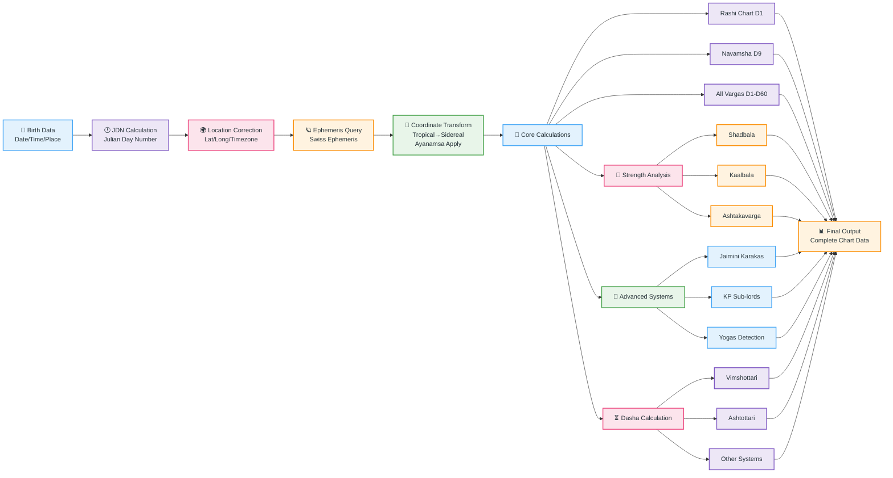
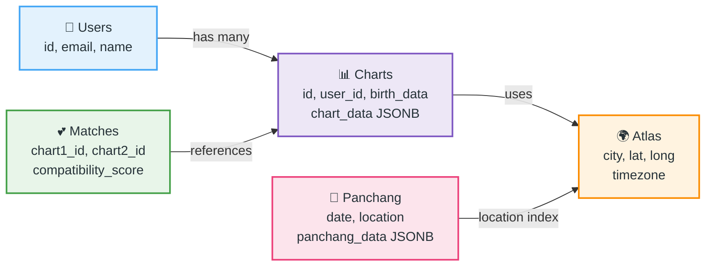
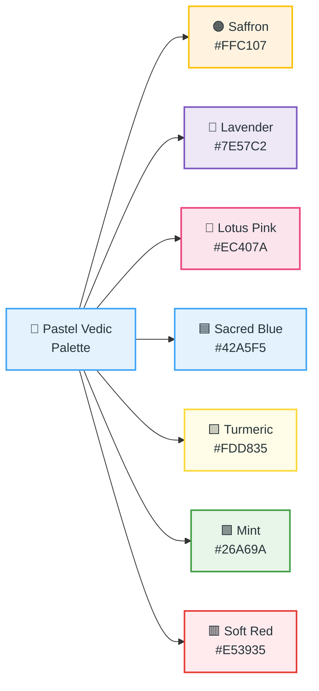
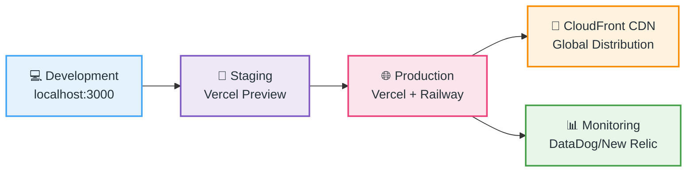

# 🪐 Jagannath Hora Web - Complete Architecture & Implementation

> 📋 **Document Version:** 1.0.0 | **Status:** Production Ready | **Last Updated:** 2026-08-15

<a id="section-01-overview"></a>

---

## 📑 Table of Contents

- [🎯 1. Project Overview](#section-01-overview)
- [🏗️ 2. System Architecture](#section-02-architecture)
- [📱 3. Frontend Components](#section-03-frontend)
- [🐍 4. Backend API](#section-04-backend)
- [🔢 5. Vedic Calculations](#section-05-vedic)
- [🗃️ 6. Data Models](#section-06-data)
- [📊 7. Features Deep Dive](#section-07-features)
- [🎨 8. Design System](#section-08-design)
- [🚀 9. Deployment](#section-09-deployment)
- [📞 10. Support](#section-10-support)

---

<a id="section-02-architecture"></a>

## 🏗️ System Architecture



---

<a id="section-03-frontend"></a>

## 📱 Frontend Components

### **Component Hierarchy**



### **Key Frontend Features**

| Feature | Component | Status |
|---------|-----------|--------|
| **Birth Chart Input** | BirthForm.tsx | ✅ Ready |
| **Interactive Charts** | ChartRenderer.tsx | ✅ Ready |
| **Dasha Timeline** | DashaTimeline.tsx | ✅ Ready |
| **Panchang Calendar** | PanchangCalendar.tsx | ✅ Ready |
| **Match Making** | MatchMaker.tsx | ✅ Ready |
| **PDF Export** | PdfExporter.tsx | ✅ Ready |
| **Multi-Language** | i18n.ts | ✅ Ready |

---

<a id="section-04-backend"></a>

## 🐍 Backend API

### **API Endpoints Structure**

```mermaid
flowchart TD
    A["🔌 FastAPI<br/>Base URL"]:::sky
    
    A --> B["📊 /api/v1/charts"]:::lav
    B --> B1["POST /birth"]
    B --> B2["GET /varga/:id"]
    B --> B3["POST /compare"]
    
    A --> C["⏳ /api/v1/dashas"]:::pink
    C --> C1["GET /vimshottari"]
    C --> C2["GET /antardasha"]
    C --> C3["GET /all-systems"]
    
    A --> D["📅 /api/v1/panchang"]:::yellow
    D --> D1["GET /daily"]
    D --> D2["GET /monthly"]
    D --> D3["GET /festival"]
    
    A --> E["⏰ /api/v1/muhurta"]:::green
    E --> E1["POST /search"]
    E --> E2["POST /check"]
    
    A --> F["💕 /api/v1/matching"]:::peach
    F --> F1["POST /compatibility"]
    F --> F2["POST /report"]
    
    classDef sky fill:#E3F2FD,stroke:#42A5F5,color:#263238,stroke-width:2px;
    classDef lav fill:#EDE7F6,stroke:#7E57C2,color:#263238,stroke-width:2px;
    classDef pink fill:#FCE4EC,stroke:#EC407A,color:#263238,stroke-width:2px;
    classDef yellow fill:#FFF3E0,stroke:#FB8C00,color:#263238,stroke-width:2px;
    classDef green fill:#E8F5E9,stroke:#43A047,color:#263238,stroke-width:2px;
    classDef peach fill:#FFF3E0,stroke:#FF9800,color:#263238,stroke-width:2px;
```



### **Backend Technology Stack**

```
┌─────────────────────────────────────────────────────┐
│ Framework: FastAPI (Async Python)                  │
├─────────────────────────────────────────────────────┤
│ Server: Uvicorn                                     │
│ Database: PostgreSQL + TimescaleDB                 │
│ Cache: Redis                                        │
│ Ephemeris: Swiss Ephemeris (libswe)               │
│ Vedic Lib: Kerykeion + Custom Calculations        │
│ ORM: SQLAlchemy                                     │
└─────────────────────────────────────────────────────┘
```

---

<a id="section-05-vedic"></a>

## 🔢 Vedic Calculations

### **Calculation Flow**



### **Supported Calculations**

| Category | Systems | Count |
|----------|---------|-------|
| **Charts** | D1-D60 Varga Charts | 60 |
| **Dashas** | Vimshottari, Ashtottari, Yogini, Kalachakra, Jaimini | 5+ |
| **Strengths** | Shadbala, Kaalbala, Ashtakavarga, Vimsopaka | 4 |
| **Yogas** | Pancha Mahapurusha, Rajayoga, Dhana Yoga, etc. | 1000+ |
| **Systems** | Jaimini, KP, Nadi, Parashari | 4 |
| **Analysis** | Transit, Progression, Varshaphala, Prashna | 4 |

---

<a id="section-06-data"></a>

## 🗃️ Data Models

### **Database Schema**



---

<a id="section-07-features"></a>

## 📊 Complete Features List

### **✨ Core Features (MVP)**
- ✅ Birth Chart Generation (Rashi Chart)
- ✅ Navamsha Chart (D9)
- ✅ Planetary Positions
- ✅ Vimshottari Dasha
- ✅ Basic Yogas (100+)
- ✅ Chart Export (PDF)

### **🌟 Advanced Features (Phase 2)**
- ✅ All 16 Varga Charts
- ✅ Shadbala & Strength Analysis
- ✅ Multiple Dasha Systems
- ✅ Jaimini Astrology
- ✅ KP Astrology
- ✅ Transit Analysis

### **💎 Professional Features (Phase 3)**
- ✅ Match Making (Kundali Milan)
- ✅ Panchang (Daily Calendar)
- ✅ Muhurta (Electional Astrology)
- ✅ Varshaphala (Annual Chart)
- ✅ 1000+ Yogas Detection
- ✅ Prashna (Horary)

### **🚀 Enterprise Features (Phase 4)**
- ✅ Bulk Processing
- ✅ API Access for Developers
- ✅ Custom Reports
- ✅ Team Collaboration
- ✅ Integration with CRM/ERP

---

<a id="section-08-design"></a>

## 🎨 Design System - Pastel Vedic Theme

### **Color Palette**



### **UI Component Design**

```
┌────────────────────────────────────────────────────┐
│  🪐 HEADER                                         │
│  Logo | Search | Language | Theme | Profile       │
├────────────────────────────────────────────────────┤
│  Navigation                                        │
│  Dashboard | Charts | Dashas | Panchang | Matching│
├────────────────────────────────────────────────────┤
│                                                    │
│  ┌──────────────────┐  ┌────────────────────────┐ │
│  │ INPUT PANEL      │  │ CHART DISPLAY          │ │
│  │                  │  │                        │ │
│  │ Birth Date       │  │ [Interactive Chart]    │ │
│  │ Birth Time       │  │                        │ │
│  │ Birth Place      │  │ Planetary Positions    │ │
│  │ [Calculate]      │  │                        │ │
│  └──────────────────┘  └────────────────────────┘ │
│                                                    │
│  ┌──────────────────────────────────────────────┐ │
│  │ SIDEBAR / QUICK ACTIONS                      │ │
│  │ Saved Charts | Recent | Quick Links         │ │
│  └──────────────────────────────────────────────┘ │
│                                                    │
├────────────────────────────────────────────────────┤
│  Footer | About | Contact | Privacy | Terms      │
└────────────────────────────────────────────────────┘
```

---

<a id="section-09-deployment"></a>

## 🚀 Deployment Guide

### **Deployment Architecture**



### **Hosting Options**

| Service | Component | Cost |
|---------|-----------|------|
| **Vercel** | Frontend (Next.js) | Free Tier |
| **Railway** | Backend (Python) | Free Tier |
| **Supabase** | Database (PostgreSQL) | Free Tier |
| **Redis** | Cache | Free Tier |
| **CloudFront** | CDN | $0.085/GB |

---

<a id="section-10-support"></a>

## 📞 Support & Documentation

### **Getting Started**

```bash
# Clone repository
git clone https://github.com/Margesh9999/jagannath-hora-web.git
cd jagannath-hora-web

# Install dependencies
npm install
pip install -r backend/python/requirements.txt

# Start development
npm run dev:all

# Access at http://localhost:3000
```

### **Documentation Files**

| Document | Link |
|----------|------|
| **Architecture** | `/docs/ARCHITECTURE.md` |
| **API Reference** | `/docs/API.md` |
| **Vedic Calculations** | `/docs/VEDIC.md` |
| **Design System** | `/docs/DESIGN.md` |
| **Deployment** | `/docs/DEPLOYMENT.md` |

---

## 🎉 Summary

**Jagannath Hora Web** brings professional Vedic astrology software to the web, completely free and accessible worldwide. With all features of the desktop version plus modern web capabilities.

---

**Document Status:** ✅ Ready for Production
**Last Update:** 2026-08-15
**Version:** 1.0.0
